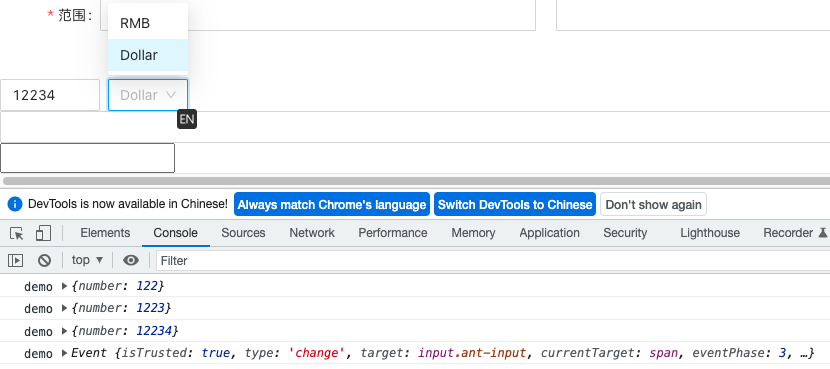

# 背景

在开发一个以json配置为输入，通过vue的渲染函数生成表单的库时，遇到一个问题。

```js
return {
    type: 'form-item',
    props: {
        label,
        ...formItem,
        rules,
        name: modelKey
    },
    children: [{
        type,
        props: {
            value: getByPath(ctx.modelValue, modelKey),
            ...props,
            ...eventsInjected,
            // UI库的组件在值发生变化时，会触发change事件，因此在这里捕获change事件，并把值更新到外层双向绑定的变量上去
            onChange: (e: any) => {
                const modelValue = (e && e.target) ? e.target.value : e;
                setByPath(this.modelValue, modelKey, modelValue);
            },
        },
    }]
}
```

因为是通过render函数渲染，能渲染UI库的组件，也能渲染自定义组件，自定义组件demo如下：

```js
// @see https://github.com/vueComponent/ant-design-vue/blob/feat-v3.3/components/form/demo/price-input.vue
<template>
  <span>
    <a-input :value="value.number" style="width: 100px" @change.prevent="onNumberChange"/>
    <a-select
      :value="value.currency"
      style="width: 80px; margin: 0 8px"
      :options="[
        { value: 'rmb', label: 'RMB' },
        { value: 'dollar', label: 'Dollar' },
      ]"
      @change="onCurrencyChange"
    ></a-select>
  </span>
</template>

<script>
import {defineComponent} from 'vue';
import {Form} from 'ant-design-vue';
export default defineComponent({
    props: {
        value: {type: Object, default: () => ({})}
    },
    setup(props, {emit}) {
        const formItemContext = Form.useInjectFormItemContext();
        const triggerChange = changedValue => {
            // 和ant-design-vue的demo比，因为针对其它组件用change事件捕获数据变更，所以在这里也想触发change事件让外面捕获
            emit('change', {...props.value, ...changedValue});
            // emit('update:value', { ...props.value, ...changedValue });
            formItemContext.onFieldChange();
        };
        const onNumberChange = e => {
            const newNumber = parseInt(e.target.value || '0', 10);
            triggerChange({number: newNumber});
        };
        const onCurrencyChange = newCurrency => {
            triggerChange({currency: newCurrency});
        };
        return {
            onNumberChange,
            onCurrencyChange
        };
    }
});
</script>
```
预期当demo组件中的值发生变更的时，父组件写的change事件处理函数将会收到这样格式的参数：
```js
{
    number: 1,
    currency: 'dollar'
}
```
问题出在，当这个demo组件中的input组件在持续输入时表现正常，但是在失去焦点时候会收到一个预期之外的数据格式：


这就导致外层的数据格式会有问题。经过排查发现

- [change事件](https://developer.mozilla.org/zh-CN/docs/Web/API/HTMLElement/change_event)

- 原生input的change事件会在失去焦点的时候触发
- 翻阅ant-design-vue的源码，a-input上的change事件其实是合并了input事件和change事件
- 当只有一个组件的时候，这两个事件的回调参数是相同格式的，demo里在input失去焦点的时候又触发了原生的change事件，且事件不能取消冒泡，导致此问题