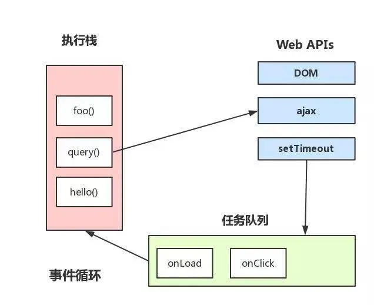
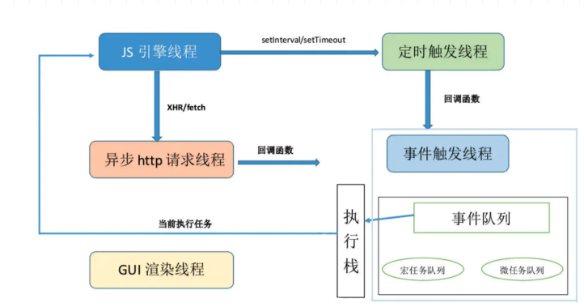

# js执行顺序


  

## 任务与队列

- js的执行顺序是自上而下顺序执行的
- js中没有多线程的概念，所有的程序都是单线程依次执行的
- 任务与调用栈
  - 由于单线程的特性，每个 JavaScript 执行上下文只有一个调用栈，其中保存着当前任务中所有未执行完的函数
  - 只要调用栈非空，JavaScript 引擎就会持续地、不被打断地（从进程内的角度来看）执行完当前栈中的所有函数
  - 调用栈被清空时意味着当前任务执行结束
- Task Queue（宏任务）
  - 是事件循环的主要数据结构
  - 当前调用栈为空时（上一个任务已经完成），事件循环机制会持续地轮询 Task Queue，只要队列中有任务就拿出来执行
  - 在任务执行期间插入的任务会进入 Task Queue 尾部
  - script全部代码、setTimeout、setInterval、setImmediate、I/O、UI事件、页面渲染
- Microtask Queue（微任务）
  - 在 Task Queue 的每个任务执行结束后，下一个任务执行开始前，会执行并清空 Microtask Queue 中的所有任务
  - 在 Microtask 执行期间插入的任务也会进入当前 Microtask Queue
  - Promise、Object.observe、MutationObserver、Process.nextTick（Node独有）

  - then有可能在宏任务队列，也有可能在微任务队列，和浏览器实现有关系
    - [在Promises/A+规范的Notes 3.1](https://promisesaplus.com/#notes)中提及了promise的then方法可以采用“宏任务（macro-task）”机制或者“微任务（micro-task）”机制来实现。
    - `.then`传入的回调是异步的，`new Promise`传入的回调是同步执行的


## Event Loop处理过程

```js
setTimeout(() => console.log('setTimeout'));
Promise.resolve().then(() => {
    console.log('Promise');
    Promise.resolve().then(() => console.log('Promise queued by Promise'));
});
console.log('stack');
```

```js
stack
Promise
Promise queued by Promise
setTimeout
```

## 渲染时机
- UI 渲染和交互的处理是通shi过 Task Queue 来调度的，因此耗时任务会导致渲染和交互任务得不到调用，也就是页面“卡死”
- 单个的耗时任务和 Microtask Queue 都会阻塞页面交互，Task 则不影响
  - 因为 Task 之间浏览器有机会会插入 UI 任务

## Event loop处理过程

一个event loop只要存在，就会不断执行下边的步骤：
- 在tasks队列中选择最老的一个task,用户代理可以选择任何task队列，如果没有可选的任务，则跳到下边的microtasks步骤。
- 将上边选择的task设置为正在运行的task。
- Run: 运行被选择的task。
- 将event loop的currently running task变为null。
- 从task队列里移除前边运行的task。
- Microtasks: 执行microtasks任务检查点。（也就是执行microtasks队列里的任务）
- 更新渲染（Update the rendering）...
- 如果这是一个worker event loop，但是没有任务在task队列中，并且WorkerGlobalScope对象的closing标识为true，则销毁event loop，中止这些步骤，然后进行定义在Web workers章节的run a worker。
- 返回到第一步。

## 事件循环机制与线程

  


## 参考文档

- @see https://juejin.cn/post/7103679289245040653
- @see [事件循环是如何影响页面渲染的？](https://github.com/aooy/blog/issues/5)
